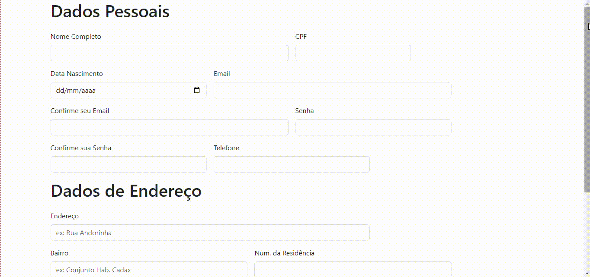

## Indice

* [Descrição](#descrição)
* [Site](#site)
* [Finalizando](#finalizando)
* [Sites](#sites)
* [Tecnologias utilizadas](#tecnologias-utilizadas)
* [Autores](#autores)
 
## Descrição
No trabalho proposto sobre o formulário de ecommerce, foi utilizados 3 sites, sendo eles: Shopee, Amazon e Mercado livre. Cujo mesmo foi retirado seus fomulários de compra. Onde desses sites o que mais apresenta campos de preenchimento é a empresa/site da shopee.

Após isso foi proposto em sala um trabalho para fazer um formulário com as caracteristicas que foram pega dos 3 sites para produzir um formulário de cadastro.

## Site
O site de cadastro e bem simples e interativo, não dificultando a vida de pessoas que não tem certo conhecimento as tecnologias que não sabem mexer em computadores e celulares.
Ao entrar no site você irá se deparar com tela do formulário com os seguintes campos:

* Dados pessoais

Nome Completo - Campo onde colacar seu nome;

CPF - Colocar seu CPF;

Data Nascimento - Coloque sua data de nascimento;

Email - Colocar seu email pessoal ou de trabalho e não colocar email que não usa com certa constância;

Confirme seu email - confirmar seu email;

Senha - Coloque sua senha que você criou no proprio site;

Confirme sua senha - confirme a senha digitada;

Telefone - colocar o telefone ou celular pessoal;

* DADOS DE ENDEREÇO

Endereço - Colocar o endereço onde você reside atualmente ou onde você quer que o pedido chegue;

Bairro - Colocar o bairro de onde você reside;

Num. da Residência - Colocar o número de identificação de sua casa ou condominio;

Complemento - Colocar descrição e mais detalhes (se precisar) sobre seu local de entrega;

CEP - Colocar o CEP de moradia;

Cidade - Colocar a cidade cujo você reside;

Estado - colocar o estado onde você reside;

## Finalizando

Os sites pegos ajudaram e muito na construção do site e na busca de irformações sobre oque se pede em lojas de comércio online. Assim sendo, consegui entender cada tópico e cada dado pedido.

## Tecnologias Utilizadas
* ``HTML 5``
* ``GITHUB``
* ``BOOTSTRAP 5``
* ``VS CODE``
* ``TEAMS``

## Sites
* ``AMAZON`` - Uma empresa americana entre as maiores do mundo.
* ``MERCADO LIVRE`` - Uma empresa Argentina mas com seus clientes no Brasil.
* ``SHOPEE`` - Uma empresa Chinesa que atua no Brasil.

## Autores
* ``Aluno 1ºC:``Rafael Souza Mastellini
